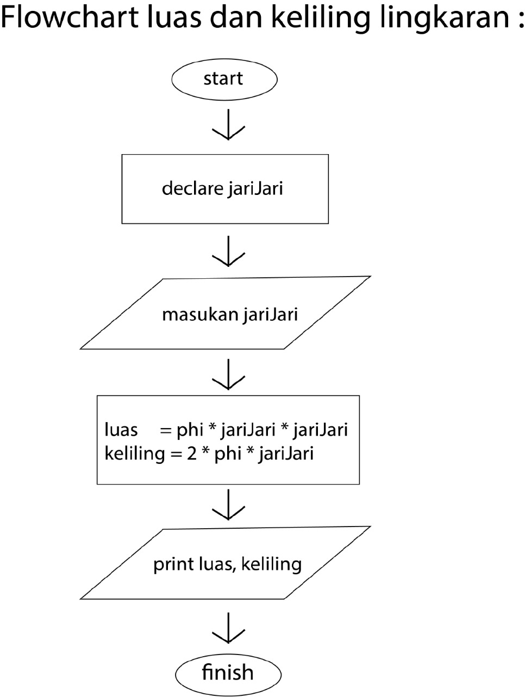

# Menghitung Luas Dan Keliling Lingkaran Menggunakan Pyton

1. Buat File Bernama LuasKelilingLingkan.py

2. Berikut Flowchart untuk menghitung luas dan kelilinf lingkaran

3.Lalu Masukkan CODE berikut

4.Ketika dijalankan inputan Jari jari dan Berikut Hasil nya

5. Finish, Cara Menghitung Luas dan Keliling Lingkaran
   